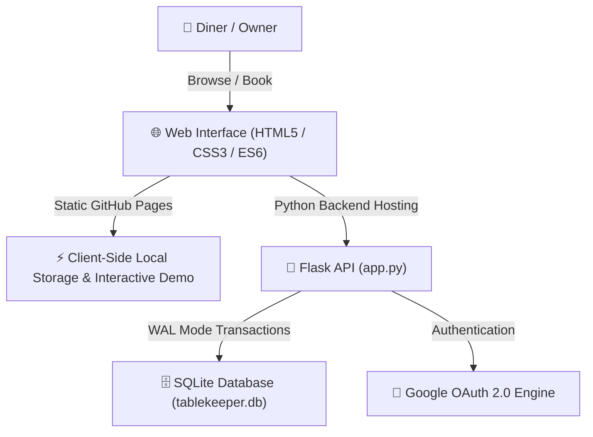

# 🍽️ Tablekeeper — Restaurant Reservation & Table Management Platform

[](https://www.python.org/)
[](https://flask.palletsprojects.com/)
[](https://www.sqlite.org/)
[](https://punithreddy678-hub.github.io/tablekeeper/)
[](LICENSE)

**Tablekeeper** is a restaurant table reservation platform featuring a diner discovery portal, real-time table availability matrix, partner owner portal, Google OAuth authentication, and concurrency control.

---

## 🌐 Live Demos & Deployment Options

| Hosting Target | Status | Type | Link |
| :--- | :--- | :--- | :--- |
| **GitHub Pages** | 🟢 Live | Static Client Demo Mode | [View GitHub Pages Site](https://punithreddy678-hub.github.io/tablekeeper/) |
| **Render / Cloud** | 🟢 Ready | Full Python + SQLite Backend | Deploy via `render.yaml` |

> ℹ️ **Why GitHub Pages requires static mode**: GitHub Pages hosts static assets (HTML/CSS/JS) and cannot run background Python processes (`app.py`). To enable immediate GitHub Pages viewing, a root `index.html` with client-side interactive fallback mode has been configured.

---

## 🌟 Key Features

* **🍽️ Diner Reservation Portal**: Explore partner restaurants, select date/time/party size, and view real-time table grid availability.
* **💼 Partner Owner Portal**: 1-Click login for restaurant owners (`olive@tablekeeper.local`, `owner123`) to approve, decline, or manage reservations.
* **🔑 Google OAuth Sign-In**: Integrated Google Identity Services SDK for guest user login.
* **🔒 Concurrency & Double-Booking Protection**: Atomic transactional locks preventing double bookings under high traffic.
* **⚡ Dual-Mode Execution**:
  * **Static Mode**: Runs 100% in the browser for GitHub Pages.
  * **Full Stack Mode**: Powered by Flask, SQLite (WAL mode), and Gunicorn.

---

## 🏗️ Architecture Overview



---

## 📂 Repository Structure

```text
tablekeeper/
├── .github/
│   └── workflows/
│       └── deploy-pages.yml     # Automated GitHub Pages deployment workflow
├── static/
│   ├── app.js                   # Application state engine & static fallback
│   └── styles.css               # Glassmorphic UI styles & responsive CSS
├── templates/
│   └── index.html               # Jinja2 Flask template
├── .gitignore                   # Excluded build artifacts & DB files
├── Procfile                     # Gunicorn WSGI server configuration
├── README.md                    # Project documentation
├── app.py                       # Flask REST API backend & database manager
├── index.html                   # Root HTML entry point for GitHub Pages
